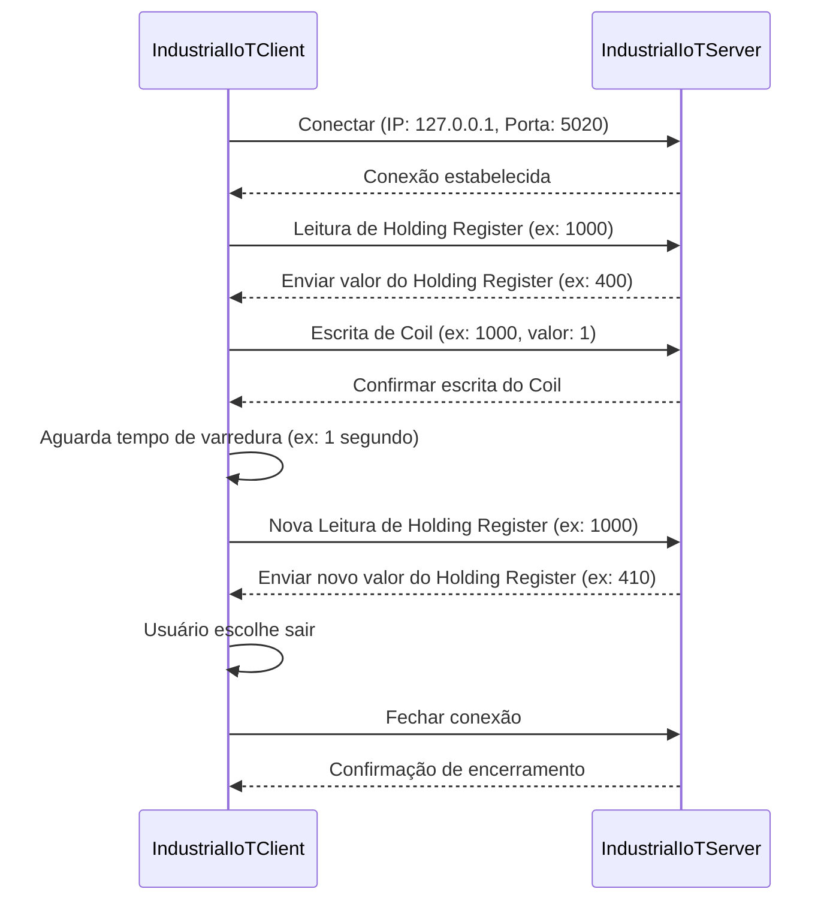

# Simulação de Comunicação Modbus TCP entre Cliente e Servidor com Pymodbus: Implementação, Integração e Execução
## Índice

1. [Implementação do Servidor Modbus TCP](#implementação-do-servidor-modbus-tcp)
   - 1.1. [Importações](#importações)
   - 1.2. [Classe IndustrialIoTServer](#classe-industrialiotserver)
   - 1.3. [Função _create_modbus_context](#função-_create_modbus_context)
   - 1.4. [Função _create_device_identity](#função-_create_device_identity)
   - 1.5. [Função start](#função-start)
   - 1.6. [Função _start_modbus_server](#função-_start_modbus_server)
   - 1.7. [Função _simulate_process](#função-_simulate_process)
   - 1.8. [Função _update_registers](#função-_update_registers)
   - 1.9. [Função _display_register_values](#função-_display_register_values)

2. [Implementação do Cliente Modbus TCP](#implementação-do-cliente-modbus-tcp)
   - 2.1. [Importações](#importações)
   - 2.2. [Classe IndustrialIoTClient](#classe-industrialiotclient)
   - 2.3. [Função run](#função-run)
   - 2.4. [Função _get_user_choice](#função-_get_user_choice)
   - 2.5. [Função _handle_read_operation](#função-_handle_read_operation)
   - 2.6. [Função _handle_write_operation](#função-_handle_write_operation)
   - 2.7. [Função _configure_scan_interval](#função-_configure_scan_interval)
   - 2.8. [Função _read_data](#função-_read_data)
   - 2.9. [Função _write_data](#função-_write_data)

3. [Integração e Execução do Servidor e Cliente](#integração-e-execução-do-servidor-e-cliente)
    - 3.1 [Arquivo main_server.py](#arquivo-main_serverpy)
    - 3.2 [Arquivo main_client.py](#arquivo-main_clientpy)
    - 3.3 [Execução do programa](#execução-do-programa)
    - 3.4 [Relacionamento Cliente vs Servidor](#relacionamento-entre-servidor-e-cliente)


## Implementação do Servidor Modbus TCP

Nesta implementação, o **servidor Modbus TCP** simula um ambiente industrial, onde dados são armazenados e atualizados, representando, por exemplo, o estado de sensores e atuadores. Ele responde às solicitações de um cliente Modbus, que pode ser um sistema de monitoramento ou controle.

### Importações

```python
from pymodbus.server import StartTcpServer
from pymodbus.datastore import ModbusSlaveContext, ModbusServerContext
from pymodbus.device import ModbusDeviceIdentification
from pymodbus.datastore.store import ModbusSequentialDataBlock
from threading import Thread
import random
from time import sleep
```
Aqui, importamos as funções e classes necessárias:

-   `StartTcpServer`: Inicializa o servidor Modbus TCP.
-   `ModbusSlaveContext`: Define o contexto (armazenamento de dados) para o servidor Modbus.
-   `ModbusServerContext`: Gerencia o contexto do servidor, permitindo múltiplos escravos Modbus.
-   `ModbusDeviceIdentification`: Armazena informações de identificação do dispositivo Modbus.
-   `ModbusSequentialDataBlock`: Armazena os blocos de dados Modbus de maneira sequencial.
-   `Thread`: Biblioteca padrão para manipular threads, usada para rodar o servidor em paralelo.
-   `random`: Biblioteca padrão para gerar valores aleatórios.
-   `sleep`: Pausa a execução do programa por um tempo determinado.

### Classe IndustrialIoTServer
```python
class IndustrialIoTServer:
    def __init__(self, host_ip: str, port: int):
        self._context = self._create_modbus_context()
        self._identity = self._create_device_identity()
        self._server_address = (host_ip, port)
```
A classe `IndustrialIoTServer` é definida para criar um servidor Modbus que simula um ambiente industrial de IoT. No construtor `__init__`, são criados três atributos:
    1. `_context`: Cria o contexto Modbus (dados armazenados no servidor).
    2. `_identity`: Define as informações de identidade do dispositivo Modbus.
    3. `_server_address`: Armazena o IP e a porta do servidor.

### Função _create_modbus_context()
Aqui, criamos o contexto do servidor Modbus. O contexto pode ser entendido como o "banco de dados" ou "área de memória" do servidor onde os dados (valores de sensores ou estados de dispositivos) são armazenados e organizados. Quando o cliente (mestre) faz uma requisição ao servidor (escravo), ele acessa ou modifica esses dados armazenados no contexto.
```python
def _create_modbus_context(self) -> ModbusServerContext:
    store = ModbusSlaveContext(
        di=ModbusSequentialDataBlock(0, [0] * 100),
        co=ModbusSequentialDataBlock(0, [0] * 100),
        hr=ModbusSequentialDataBlock(1000, [0] * 100),
        ir=ModbusSequentialDataBlock(0, [0] * 100)
    )
    return ModbusServerContext(slaves=store, single=True)
```
A função define um `ModbusSlaveContext`, que contém:
- `di` **Discrete Inputs (entradas discretas, apenas leitura):** são como interruptores que o cliente pode apenas observar. Eles têm 100 posições, todas inicialmente com o valor 0.

- `co` **Coils (bobinas, leitura e escrita):**  são como interruptores que o cliente pode ligar e desligar. Existem 100 posições, todas começando com o valor 0.

- `hr` **Holding Registers (registros de retenção, leitura e escrita)**:  são como campos que podem armazenar valores numéricos, como leituras de temperatura. Eles começam a partir do endereço 1000, com 100 posições, todas iniciadas com o valor 0.
- `ir` **Input Registers (registros de entrada, somente leitura):**  são como campos de leitura, que o cliente pode apenas visualizar. Eles também têm 100 posições, iniciadas com o valor 0.

O `ModbusServerContext` é retornado com o escravo configurado no `store`. O parâmetro `single=True` indica que é um único escravo (mestre-escravo é um padrão Modbus).

### Função _create_device_identity()
A função _create_device_identity cria a identidade do servidor Modbus, que basicamente fornece informações sobre o "dispositivo" (o servidor Modbus) para o cliente que se conecta a ele. Pense nisso como uma "etiqueta de identificação" ou um "cartão de visita" que informa ao cliente os detalhes do servidor.
```python
def _create_device_identity(self) -> ModbusDeviceIdentification:
    identity = ModbusDeviceIdentification()
    identity.VendorName = 'Pymodbus'
    identity.ProductCode = 'PM'
    identity.VendorUrl = 'http://github.com/riptideio/pymodbus/'
    identity.ProductName = 'Pymodbus Server'
    identity.ModelName = 'Industrial IoT CLP Server'
    identity.MajorMinorRevision = '1.0'
    return identity
```
- `VendorName`: O nome do fabricante ou empresa que criou o servidor Modbus. No caso, "Pymodbus" é o nome da biblioteca.
- `ProductCode`: Um código ou número que identifica o produto, como um "código de série". Aqui usamos 'PM' como exemplo.
- `VendorUrl`: O site do fabricante onde você pode encontrar mais informações. No exemplo, é o link para o projeto Pymodbus.
- `ProductName`: O nome do produto. Neste caso, chamamos de "Pymodbus Server", o que indica que este é um servidor Modbus.
- `ModelName`: O modelo do dispositivo. Chamamos aqui de "Industrial IoT CLP Server", simulando um dispositivo de automação industrial.
- `MajorMinorRevision`: A versão do produto. Isso ajuda a saber se o dispositivo está atualizado ou qual versão está sendo usada. Aqui usamos a versão '1.0'.

### Função start()
A função start é responsável por iniciar o servidor Modbus e garantir que ele continue funcionando em segundo plano, além de simular o comportamento do servidor em um ambiente industrial.

```python
def start(self):
    try:
        server_thread = Thread(target=self._start_modbus_server)
        server_thread.daemon = True
        server_thread.start()
        self._simulate_process()
    except Exception as e:
        print("Error: ", e)
```
Temos diferentes métodos no start, entenda cada passo:
- `server_thread = Thread(target=self._start_modbus_server)`: a função cria uma thread separada para rodar o servidor Modbus. Isso permite que o servidor funcione "em segundo plano", sem interromper o restante do código.

- `server_thread.daemon = True`:  definir a thread como "daemon" significa que ela será encerrada automaticamente quando o programa principal terminar. Isso garante que o servidor não continue rodando sozinho após o fim do programa.

- `server_thread.start()`: Aqui, a thread é realmente iniciada, e o servidor começa a funcionar. Agora, ele está pronto para receber conexões de clientes que queiram se conectar via Modbus.

- `self._simulate_process()`: Enquanto o servidor roda em segundo plano, a função `self._simulate_process()` simula um processo industrial, atualizando os dados do servidor (como leituras de sensores) em tempo real.

> Uma thread é como uma tarefa separada dentro de um programa que pode ser executada ao mesmo tempo que outras. Imagine que um programa possa "fazer várias coisas ao mesmo tempo". Com threads, você pode, por exemplo, rodar um servidor enquanto outro pedaço do programa faz outras tarefas, como atualizar dados, sem que um precise esperar pelo outro.

### Função _start_modbus_server()
Esta função realmente inicializa o servidor Modbus TCP usando StartTcpServer, que utiliza o context (dados do Modbus) e identity (informações do dispositivo), além do endereço IP e porta do servidor.
```python
def _start_modbus_server(self):
    print("Modbus Server running...")
    StartTcpServer(context=self._context, identity=self._identity, address=self._server_address)
```
### Função _simulate_process()
A função` _simulate_process` simula um processo industrial contínuo, onde os valores dos registradores Modbus são atualizados e exibidos repetidamente. 
```python
def _simulate_process(self):
    sleep(2)
    while True:
        self._update_registers()
        self._display_register_values()
        sleep(1)
```
- `sleep(2)`: Faz o programa esperar por 2 segundos antes de iniciar a simulação. Isso garante que o servidor tenha tempo para se estabilizar.
- `_update_registers()`: Atualiza os registradores Modbus com valores simulados, como se fossem dados reais de sensores.
- `_display_register_values()`: Exibe os valores atualizados no console, mostrando o estado atual dos registradores.
- `sleep(1)`: Faz o programa esperar por 1 segundo entre cada ciclo de atualização e exibição, criando um intervalo regular.

### Função _update_registers()
A função `_update_registers` simula a atualização dos registradores Modbus, gerando valores aleatórios para representar dados de um sistema real, como leituras de sensores e estados de dispositivos. 
```python
def _update_registers(self):
    simulated_value = random.randint(int(0.95 * 400), int(1.05 * 400))  
    self._context[0].setValues(3, 1000, [simulated_value])
    coil_state = random.randint(0, 1) 
    self._context[0].setValues(1, 1000, [coil_state])
```
- `random.randint(int(0.95 * 400), int(1.05 * 400))`: Gera um valor aleatório entre 95% e 105% de 400. Esse valor simula, por exemplo, uma leitura de sensor (como a temperatura ou pressão), variando levemente em torno de um valor central (400).
- `self._context[0].setValues(3, 1000, [simulated_value])`: Atualiza o holding register (registrador de retenção) no endereço 1000 com o valor simulado. O código 3 refere-se ao tipo de registrador holding register no protocolo Modbus.
- `random.randint(0, 1)`: Gera um valor aleatório de 0 ou 1, que simula o estado de uma bobina (0 = desligado, 1 = ligado). Isso pode ser usado, por exemplo, para representar o estado de um relé ou motor.
- `self._context[0].setValues(1, 1000, [coil_state])`: Atualiza o coil (bobina) no endereço 1000 com o valor aleatório gerado (0 ou 1). O código 1 refere-se ao tipo de registrador coil no protocolo Modbus.

### Função _display_register_values()
A função _display_register_values exibe no console os valores armazenados nos registradores Modbus, permitindo visualizar o estado atual dos dados, como os valores dos holding registers e coils.
```python
def _display_register_values(self):
    print('======================')
    print("Modbus Table")
    print(f'Holding Register \n R1000: {self._context[0].getValues(3, 1000, count=1)}')
    print(f'Coil \n R1000: {self._context[0].getValues(1, 1000, count=1)}')
```
- `print('======================')`: Adiciona uma linha de separação no console para melhorar a visualização.
- `print("Modbus Table")`: Exibe o título "Modbus Table" para indicar que estamos mostrando os valores dos registradores Modbus.
- `getValues(3, 1000, count=1)`: Lê o valor do holding register no endereço 1000. O número 3 indica que estamos acessando um holding register (tipo de registrador que pode ser lido e escrito). O parâmetro count=1 significa que estamos lendo apenas um valor.O valor lido é exibido no formato R1000, onde R1000 representa o endereço do registrador.
- `getValues(1, 1000, count=1)`: Lê o valor da coil (bobina) no endereço 1000. O número 1 indica que estamos acessando uma bobina (tipo de registrador que pode ser lido ou escrito, geralmente usado para ligar/desligar dispositivos).O valor lido também é mostrado no formato R1000, onde R1000 representa o endereço da bobina.

## Implementação do Cliente Modbus TCP
A implementação do cliente Modbus TCP permite que o cliente se conecte ao servidor Modbus, realize operações de leitura e escrita de registradores e bobinas, e configure o intervalo entre as operações. A classe `IndustrialIoTClient` fornece uma interface de linha de comando para interagir com o servidor de forma simples e direta.

### Importações
```python
from pyModbusTCP.client import ModbusClient
from time import sleep
```
- `ModbusClient`: Importa a classe que facilita a conexão com o servidor Modbus e a execução de operações de leitura e escrita via TCP/IP.
- `sleep`: Usado para pausar a execução entre as leituras ou operações de escrita, simulando um intervalo de varredura contínuo.

### Classe IndustrialIoTClient
A classe `IndustrialIoTClient` é responsável por conectar-se a um servidor Modbus TCP e realizar as operações solicitadas pelo usuário.
```python
class IndustrialIoTClient:
    def __init__(self, server_ip: str, port: int, scan_interval: float = 1.0):
        self._client = ModbusClient(host=server_ip, port=port)
        self._scan_interval = scan_interval
```
No construtor __init__, são definidos dois atributos principais:

- `_client`: Instancia o cliente Modbus, utilizando o endereço IP e a porta do servidor. Ele será utilizado para se comunicar com o servidor.
- `_scan_interval`: Define o intervalo de tempo entre cada leitura de dados, por padrão configurado para 1 segundo.

### Função run()
A função run gerencia o ciclo de execução principal do cliente, permitindo que o usuário escolha a operação a ser realizada (leitura, escrita, configuração do intervalo de varredura ou saída).
```python
def run(self):
        self._client.open()
        try:
            active = True
            while active:
                choice = self._get_user_choice()
                if choice == '1':
                    self._handle_read_operation()
                elif choice == '2':
                    self._handle_write_operation()
                elif choice == '3':
                    self._configure_scan_interval()
                elif choice == '4':
                    self._client.close()
                    active = False
                else:
                    print("Invalid selection")
        except Exception as e:
            print(f'Error during operation: {e}')
```

### Função _get_user_choice()
Essa função exibe um menu simples no console para o usuário escolher a operação a ser realizada.
```python
def _get_user_choice(self) -> str:
    return input("Choose operation: (1- Read | 2- Write | 3- Configure | 4- Exit): ")
```

### Função _handle_read_operation()
A função` _handle_read_operation()` permite que o cliente leia dados do servidor Modbus. De forma simples, o cliente pode escolher qual tipo de dado ele quer ler (por exemplo, um registrador de retenção ou uma bobina) e de qual endereço da tabela Modbus os dados serão obtidos.

```python
def _handle_read_operation(self):
    data_type = int(input("Select data type to read (1- Holding Register | 2- Coil | 3- Input Register | 4- Discrete Input): "))  
    address = int(input("Enter MODBUS table address: "))  
    num_reads = int(input("Enter the number of reads: "))  
    for i in range(num_reads): 
        print(f"Read {i + 1}: {self._read_data(data_type, address)}")  
        sleep(self._scan_interval)  
```
- `data_type = int(input(...))`: o usuário escolhe qual tipo de dado ele quer ler.
- `address = int(input("Enter MODBUS table address: "))`: o usuário insere o endereço do registrador Modbus de onde quer ler os dados.
- `num_reads = int(input("Enter the number of reads: "))`: o usuário define quantas leituras deseja realizar.
- `for i in range(num_reads)`:  o cliente realiza as leituras conforme solicitado.
- `self._read_data()`: chama a função que lê os dados do tipo e endereço fornecido.
- `sleep(self._scan_interval)`: o cliente espera pelo intervalo configurado antes de realizar a próxima leitura.

### Função _handle_write_operation()
A função _handle_write_operation() permite que o cliente escreva (ou altere) valores no servidor Modbus. O cliente escolhe qual tipo de dado ele quer modificar (por exemplo, um registrador ou uma bobina) e em qual endereço da tabela Modbus o valor será alterado. Além disso, o cliente informa qual valor deseja escrever.
```python
def _handle_write_operation(self):
    data_type = int(input("Select data type to write (1- Holding Register | 2- Coil): "))  
    address = int(input("Enter MODBUS table address: "))  
    value = int(input("Enter value to write: "))  
    self._write_data(data_type, address, value)  
```
- `data_type = int(input("Select data type to write..."))`: o cliente escolhe qual tipo de dado ele quer alterar.
- `address = int(input("Enter MODBUS table address: "))`: o cliente insere o endereço do registrador ou bobina onde deseja escrever o valor.
- `value = int(input("Enter value to write: "))`: o cliente insere o valor que deseja escrever no endereço especificado.
- `self._write_data(data_type, address, value)`: chama a função _write_data, que executa a escrita no servidor Modbus com os parâmetros fornecidos:
	- `data_type`: O tipo de dado a ser alterado (Holding Register ou Coil).
	- `address`: O endereço onde será feita a alteração.
	- `value`: O valor que será escrito no endereço do servidor.

### Função _configure_scan_interval()
Essa função permite ao usuário definir o intervalo de tempo (em segundos) entre cada operação de leitura, configurando o atributo self._scan_interval.
```python
def _configure_scan_interval(self):
    scan_time = float(input("Enter desired scan interval [s]: "))
    self._scan_interval = scan_time
```
### Função _read_data()
Essa função realiza a leitura de dados com base no tipo de dado e endereço fornecidos pelo usuário.
```python
def _read_data(self, data_type: int, address: int):
    if data_type == 1:
        return self._client.read_holding_registers(address, 1)
    elif data_type == 2:
        return self._client.read_coils(address, 1)
    elif data_type == 3:
        return self._client.read_input_registers(address, 1)
    elif data_type == 4:
        return self._client.read_discrete_inputs(address, 1)
    else:
        print(f'Error: Invalid data type {data_type}')
        return 'Error: Invalid data type'
```
### Função _write_data()
Essa função realiza a escrita de dados no servidor Modbus.
```python
def _write_data(self, data_type: int, address: int, value: int):
    if data_type == 1:
        return self._client.write_single_register(address, value)
    elif data_type == 2:
        return self._client.write_single_coil(address, value)
    else:
        print(f'Error: Invalid data type for writing {data_type}')
```

## Integração e Execução do Servidor e Cliente

### Arquivo main_server.py
O código a seguir é responsável por iniciar o servidor Modbus TCP:
```python
from server import IndustrialIoTServer

if __name__ == "__main__":
    server = IndustrialIoTServer(host_ip="127.0.0.1", port=5020)
    server.start()
```
- `from server import IndustrialIoTServer`: importa a classe `IndustrialIoTServer` do módulo server. Essa classe é responsável por configurar e rodar o servidor Modbus, que simula um ambiente de automação industrial.
- `if __name__ == "__main__":`: essa condição é usada para garantir que o bloco de código seja executado apenas se o arquivo for executado diretamente (como um script), e não quando ele é importado como um módulo em outro arquivo.
- `server = IndustrialIoTServer(host_ip="127.0.0.1", port=5020)`: cria uma instância do servidor Modbus (IndustrialIoTServer), definindo o endereço IP do servidor como 127.0.0.1 (localhost) e a porta 5020. Isso significa que o servidor estará disponível localmente nesta porta.
- `server.start()`: inicia o servidor Modbus chamando o método start(), que coloca o servidor em funcionamento. Ele começará a aceitar conexões de clientes e responder às solicitações de leitura e escrita dos registradores Modbus.

### Arquivo main_client.py
```python
from client import IndustrialIoTClient

def main():
    server_ip = "127.0.0.1"
    port = 5020    
    scan_interval = 1.0 
    client = IndustrialIoTClient(server_ip, port, scan_interval)
    client.run()

if __name__ == "__main__":
    main()
```
- `from client import IndustrialIoTClient`: esta linha importa a classe IndustrialIoTClient que foi definida no arquivo client.py. A classe IndustrialIoTClient é responsável por se conectar a um servidor Modbus TCP, permitindo operações como leitura, escrita e configuração.
- `server_ip = "127.0.0.1"`: define o IP do servidor Modbus ao qual o cliente vai se conectar. Neste caso, o IP é "127.0.0.1", que representa o localhost (o mesmo computador em que o cliente está rodando).
- `port = 5020`: define a porta na qual o servidor está escutando por conexões, neste caso, a porta 5020.
- `scan_interval = 1.0`: define o intervalo de tempo (em segundos) entre cada leitura ou operação que o cliente faz no servidor.
- `client = IndustrialIoTClient(server_ip, port, scan_interval)`: cria uma instância do cliente Modbus, passando o IP do servidor, a porta, e o intervalo de varredura.
- `client.run()`: inicia a execução do cliente, que se conecta ao servidor e permite interações, como leitura e escrita de registradores e bobinas.

### Execução do programa
Confirme que possui python instalado com  o comando a seguir:
```
python --version
```
Caso o Python não esteja instalado, você pode baixá-lo e instalá-lo a partir do site oficial: python.org.

1. Ativar o ambiente virtual:
- Certifique-se de que você está com o ambiente virtual Python ativo.
- Para ativar o ambiente, use o comando abaixo no terminal, dependendo do sistema operacional:
- No Windows: `.\venv\Scripts\activate`
- No macOS/Linux: `source venv/bin/activate`

2. Instalar dependências:
Com o ambiente virtual ativado, você precisa instalar as dependências necessárias, que estão listadas no arquivo requirements.txt. Execute o comando: `pip install -r requirements.txt`

3. Executar o servidor: 
- Primeiro, execute o arquivo `main_server.py` para iniciar o servidor Modbus. No terminal, rode o seguinte comando: `python main_server.py`
- O servidor começará a funcionar, e você verá no terminal que ele está rodando e pronto para aceitar conexões de clientes.

4. Executar o cliente:
- Em outro terminal (sem fechar o servidor), execute o arquivo `main_client.py` para iniciar o cliente.
Rode o seguinte comando: `python main_client.py`
- O cliente se conectará ao servidor e um menu interativo aparecerá, solicitando que você escolha uma operação.


### Relacionamento entre Servidor e Cliente
A lógica de relacionamento entre o servidor e o cliente Modbus TCP envolve o seguinte fluxo de dados:
- O servidor Modbus fica em execução, aguardando conexões de clientes.
- O cliente Modbus se conecta ao servidor através de um IP e uma porta.
- O cliente pode realizar operações de leitura e escrita nos registradores e bobinas mantidos pelo servidor.
- O servidor responde a essas requisições com os dados solicitados ou executa as alterações enviadas pelo cliente.
- O cliente pode também ajustar o intervalo de varredura para operações contínuas de leitura.

